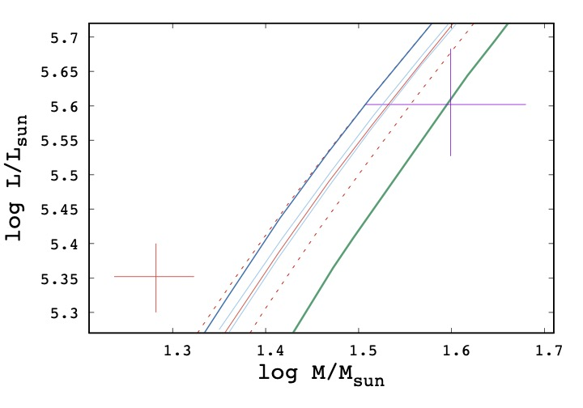

# Mass-luminosity simulation outputs for Cyg X-1

This folder contains results and plots for evaluating the relation between mass and luminosity of the companion in Cyg X-1.

All data files have two columns (logM, logL; where M and L are in units of solar mass and luminosity), and are generated with various assumptions for input parameters as expressed the file names.

